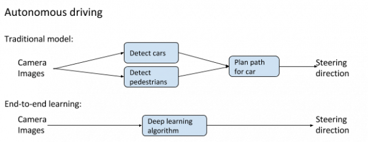

# Autonomous Driving End-to-End Deep Learning

## End-to-End Deep Learning
**End-to-end deep learning* is a modeling strategy that is a response to the success of deep neural networks. 
Unlike traditional methods, this strategy is **not built on feature engineering**. Instead, it leverages the power of **deep neural networks** to harness the incredible potential of large amounts of data. 
It is closer to a human-like learning approach than traditional ML as it **lets a neural network map raw input to direct output**. 

A big downside to this approach is that it **requires a very large amount of training data** which makes it unsuitable for many common applications. 

Since simulators can generate huge amounts of data, they are a perfect data source for end-to-end deep learning algorithms. 

With photo-realistic simulators like AirSim, it is possible to collect a large amount of data to train your autonomous driving models without having to use an actual car. 
These models can then be fine tuned using a comparably lesser amount of real-world data and used on actual cars. This technique is called **Behavioral Cloning**. 

### ToDo

- [x] Run on Python 3.7 with 2.+ TensorFlow
- [ ] Bridge behaviour
- [ ] Hills behaviour
- [ ] Different vehicles
- [ ] Different environments
- [ ] Dynamic speed

## Libraries
- Python 3.7
- Keras 2.1.2
- Tensorflow 2.3.0

## How to run

- 1-PrepareData.py

- 2-TrainModel.py

- Download Cookbook and run: .\AD_Cookbook_Start_AirSim.ps1 landscape

- 3-TestModel.py

## Dataset

[Download](https://aka.ms/AirSimTutorialDataset)

## Cookbook

[Build Package](https://airsimtutorialdataset.blob.core.windows.net/e2edl/AD_Cookbook_AirSim.7z)

## AirSim

[AirSim](https://github.com/Microsoft/AirSim)
 
## Tutorials

[MS tutorials](https://github.com/microsoft/AutonomousDrivingCookbook)